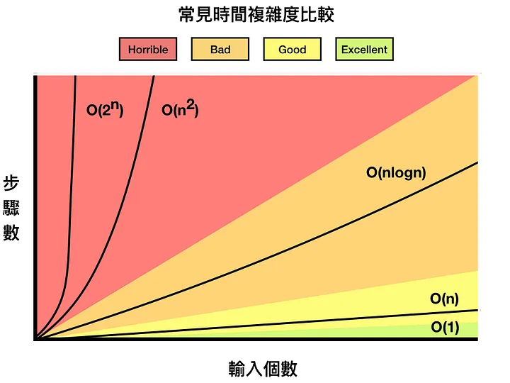

# 😨 Complexity

* 時間複雜度：執行程式所需的「步驟」與時間的關係
* 空間複雜度：執行程式所需要的「記憶體空間」

#### 常見的時間複雜度：

<table><thead><tr><th width="233">Name</th><th>Complexity</th></tr></thead><tbody><tr><td>Polynomial order</td><td>O(n^k), k為常數</td></tr><tr><td>Exponential order</td><td>O(d^n), d>1</td></tr><tr><td>NP-complete</td><td>現階段屬於複雜問題</td></tr><tr><td>Best-sorting</td><td>O(nlogn)</td></tr></tbody></table>

#### 這篇文章中有對於時間複雜度較為完整的解說：

{% embed url="https://medium.com/appworks-school/%E5%88%9D%E5%AD%B8%E8%80%85%E5%AD%B8%E6%BC%94%E7%AE%97%E6%B3%95-%E8%AB%87%E4%BB%80%E9%BA%BC%E6%98%AF%E6%BC%94%E7%AE%97%E6%B3%95%E5%92%8C%E6%99%82%E9%96%93%E8%A4%87%E9%9B%9C%E5%BA%A6-b1f6908e4b80" %}

<figure><figcaption>
從這張表我們可以發現當括號內部越傾向於指數關係代表該演該演算法越糟糕
</figcaption></figure>

