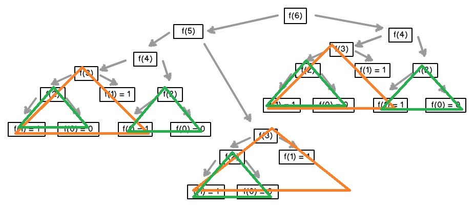

# Fibonacci Sequence

> **def:**&#x20;
>
> &#x20;       $$f_n = 0, if n = 0$$
>
> &#x20;       $$f_n =1,ifn=1$$
>
> &#x20;      $$f_n=f_(n-1)+f_(n-2) ,ifn\geq2$$  //n-1、n-2都是小標

```c
// Iterative code
int fib(int n){
    if(n <= 1){
        return n;
    }
    lofib = 0;
    hifib = 1;
    for(i = 2;i < n; i++){ //i最低要從2開始
        int x = lofib;
        lofib = hifib;
        hifib = x + lofib;
    }
    return hifib;
}
```

```c
// Recursion code
int fib(int n){
    int x, y;
    if(n <= 1){ //注意邊界條件
        return n;
    }
    return(fib(n-1)+fib(n-2)); //要重複不斷地呼叫自己直到n<=1;
}
```

<figure><figcaption><p>從圖中可以發現透過遞迴呼叫會有很多<mark style="color:blue;"><strong>重複行為</strong></mark>，例如：f(3)、f(2)，因此<mark style="color:blue;">遞迴呼叫不一定是有效率的</mark></p></figcaption></figure>

