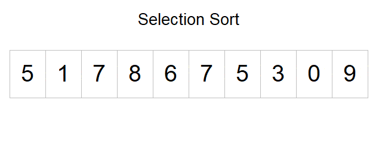

# Selection Sort

#### 示意GIF：

<figure><figcaption></figcaption></figure>

時間複雜度：O(n^2)

因為比較次數為：\space(n-1)+(n-2)+......+1=n(n-1)/2


```c
// C 實作
void sort(int *a, int n){
	int i, j, k, temp;
	for(i=0;i<n;i++){
		for(j=i+1;j<n;j++){
			if(a[i]>a[j]){
				temp = a[i];
				a[i] = a[j];
				a[j] = temp;
			}
		}
	}
}
```

### 同場加映：Bubble Sort

泡沫排序法：將兩個相鄰的數值相比，假如前一個數值比後一個數值大時，就互相對調\
時間複雜度：O(n^2)，因為外圈會跑n次，內圈跑n-i-1次，迴圈次數要相乘，因此最高次方是n^2

<figure><figcaption></figcaption></figure>

```c
// C 實作
//寫法一
void sort(int *a, int n){
	int i, j, k, temp;
	for(i=n;i>0;i--){ //i代表總共有幾個元素要交換
		for(j=0;j<i-1;j++){ //j代表從第0個元素開始依序交換
			if(a[j]>a[j+1]){
				temp = a[j];
				a[j] = a[j+1];
				a[j+1] = temp;
			}
		}
	}
}
//寫法二(這種寫法比較常見)
void sort(int *a, int n){
	int i, j, k, temp;
	for(i=0;i<n-1;i++){ //i代表趟數，總共要跑n-1趟 
		for(j=0;j<n-i-1;j++){ //j代表每一趟要交換的次數，總共要n-i-1次 
			if(a[j]>a[j+1]){
				temp = a[j];
				a[j] = a[j+1];
				a[j+1] = temp;
			}
		}
	}
}
```


### 同場加映2：Insertion Sort

(再說)
