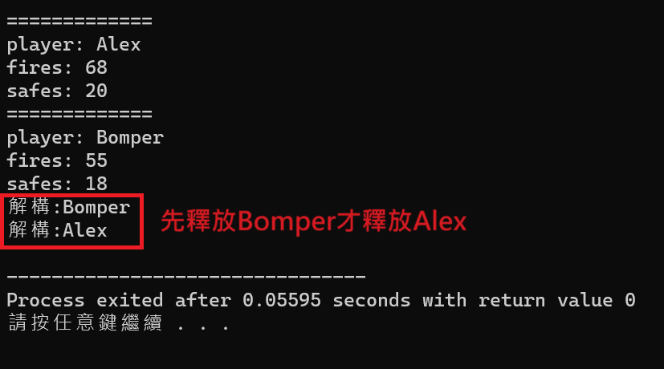

# Constructor & Destructor

建構子：賦予Class內部成員（內容物）初始化資料；解構子：當程式結束或物件不被使用後，用來釋放記憶體的函數

#### Constructor

> **def:**建構子是和類別名稱相同的函數成員，用來預設資料成員的初始值，需要注意的是，建構子須設定為pubklic型態，並且無法指定傳回型態；如果類別中沒有撰寫建構子，C++編譯器會主動建立預設建構子。

<pre class="language-cpp"><code class="lang-cpp">// 建立一個baseball的class物件
#include&#x3C;iostream>
#include&#x3C;cstdlib>
#include&#x3C;cstring>
using namespace std;

class baseball{ //baseball類別宣告
	private:
		char player[20]; //打擊者姓名
		int fires; //打擊次數
		int safes; //安打次數
	public:
		void showplayer(); //打印函數 
		//建構子有兩種方式可以使用，分別是預設型以及參數型，差別在於有沒有傳入參數
		<a data-footnote-ref href="#user-content-fn-1">baseball();</a> //宣告建構子函數,不帶參數(預設好) 
		<a data-footnote-ref href="#user-content-fn-2">baseball(char *name, int fs, int ss);</a> //宣告建構子函數,帶參數(讓使用者輸入)
};

baseball::baseball(){ //透過建構子給定函數初始值 
	strcpy(player,"Alex"); //打擊者姓名設為"Alex" 
	fires = 68; //打擊數設為68
	safes = 20; //安打數設為20
}

baseball::baseball(char *name, int fs, int ss){ //利用傳入參數賦予資料成員初始值 
	strcpy(player, name); //接收輸入姓名 
	fires = fs; //接收輸入值fs 
	safes = ss; //接收輸入值ss
}
void baseball::showplayer(void){ //打印函數
	cout&#x3C;&#x3C;"============="&#x3C;&#x3C;endl;
	cout&#x3C;&#x3C;"player: "&#x3C;&#x3C;player&#x3C;&#x3C;endl;
	cout&#x3C;&#x3C;"fires: "&#x3C;&#x3C;fires&#x3C;&#x3C;endl;
	cout&#x3C;&#x3C;"safes: "&#x3C;&#x3C;safes&#x3C;&#x3C;endl;
}

int main(){
	baseball b; //宣告一個baseball類別的b物件，建構子自行指定初始值 
	baseball b1("Bomper", 55, 18); //宣告一個baseball類別的b1物件，並帶入資料成員初始值 
	b.showplayer(); //呼叫b物件中的showplayer功能 
	b1.showplayer();
	
	return 0;
}
</code></pre>

#### Destructor

> **def**:解構子是當物件不再使用或是程式結束時，用來釋放記憶體空間之用；解構子不可以多載(overload)，也不回傳值，亦不包含任何參數。當程式結束時會以反序方式進行解構，意即，最初建立的建構子會在最後被釋放(類似FILO的概念)

```cpp
// 解構子的應用
// 建立一個baseball的class物件
#include<iostream>
#include<cstdlib>
#include<cstring>
using namespace std;

class baseball{ //baseball類別宣告
	private:
		char player[20]; 
		int fires; 
		int safes; 
	public:
		void showplayer(); 
		baseball(); 
		baseball(char *name, int fs, int ss); 
		~baseball(){ //宣告解構子 
			cout<<"解構:"<<player<<endl; //打印解構成員(這樣才知道釋放了什麼) 
		}
};

baseball::baseball(){ //預設型 
	strcpy(player,"Alex"); 
	fires = 68; 
	safes = 20; 
}

baseball::baseball(char *name, int fs, int ss){ //參數型 
	strcpy(player, name); 
	fires = fs; 
	safes = ss; 
}
void baseball::showplayer(void){ 
	cout<<"============="<<endl;
	cout<<"player: "<<player<<endl;
	cout<<"fires: "<<fires<<endl;
	cout<<"safes: "<<safes<<endl;
}

void call_object(){ //呼叫物件(只是把原本放在主程式的東西移來這裡) 
	baseball b; 
	baseball b1("Bomper", 55, 18); 
	b.showplayer(); 
	b1.showplayer();
}
int main(){
	call_object();
	return 0;
}
```

<figure><figcaption><p>輸出結果</p></figcaption></figure>

[^1]: 使用預設值的建構子

[^2]: 透過參數賦予值的建構子
