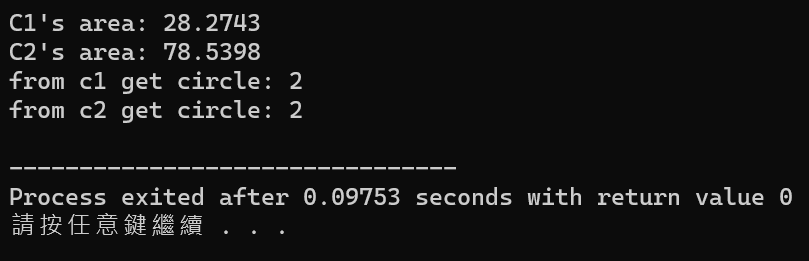

# Static Members

### Static Members

> **def:**在類別中，當一個成員被宣告為靜態時，其他成員皆可分享該成員的資料；靜態成員沒有this指標，採用"static"來宣告；和一般要在類別內透過建構子宣告初始值的成員不同，靜態成員的初始值要在類別之外宣告，並且，靜態成員不能重複進行初始值宣告。

```cpp
// 靜態成員
#include<iostream>
#include<cstdlib>
#include<cstring>
using namespace std;

class Baseball{ //宣告Baseball物件 
	private:
		char player[20];
		int fires;
		int safes;
		float countsafe(void);
	public: 
		//宣告靜態成員
		static long sumfires; //總打擊次數 
		static long sumsafes; //總安打次數 
		
		void inputplayer();
		void showplayer();
};

//在類別之外宣告靜態成員的初始值 
long Baseball::sumfires = 0;
long Baseball::sumsafes = 0;

//輸入資料函數 
void Baseball::inputplayer(){ 
	cout<<"player: ";
	cin>>player;
	cout<<"fires: ";
	cin>>fires;
	cout<<"safes: ";
	cin>>safes;
}

//打印函數 
void Baseball::showplayer(void){
	float fs;
	fs = countsafe();  
	cout<<"player: "<<player<<endl;
	cout<<"fires: "<<fires<<endl;
	cout<<"safes: "<<safes<<endl;
	cout<<"coutsafe: "<<fs<<endl;
	  
	sumfires = sumfires + long(fires); //累加總打擊次數 
	sumsafes = sumsafes + long(safes); //累加總安打次數 
}

//計算打擊率函數 
float Baseball::countsafe(){  
	float counts; //打擊率
	counts = (float(safes)/float(fires)); //計算打擊率 
	return counts; 
}

//宣告sumcountsafe函數以計算總打擊率
float sumcountsafe(){
	float sumcounts;
	sumcounts = (float (Baseball::sumsafes) / float (Baseball::sumfires));
	return sumcounts;
} 
 
//宣告sumshowplayer函數以打印總打擊次數、總安打率、總打擊率
void sumshowplayer(void){
	float sumfs;
	sumfs = sumcountsafe();
	cout<<"===================="<<endl;
	cout<<"sumfires: "<<Baseball::sumfires<<endl;
	cout<<"sumsafes: "<<Baseball::sumsafes<<endl;
	cout<<"sumfs: "<<sumfs<<endl;
} 

//宣告clearsum函數以將靜態類別資料成員初始值設為0 
void clearsum(){
	Baseball::sumfires = 0;
	Baseball::sumsafes = 0;
	cout<<"=============="<<endl;
	cout<<"initialize sumfires: "<<Baseball::sumfires<<endl;
	cout<<"initialize sumsafes: "<<Baseball::sumsafes<<endl;
}

int main(){
	Baseball b[3];
	int i;
	
	cout<<"enter data"<<endl;
	cout<<"====================="<<endl;
	for(i=0;i<3;i++){
		b[i].inputplayer();
	}
	
	cout<<"\nprint data"<<endl;
	cout<<"====================="<<endl;
	for(i=0;i<3;i++){
		b[i].showplayer();
	}
	
	sumshowplayer(); //在最後呈現三個人相加的總打擊次數、總安打次數以及總打擊率
	clearsum(); //清除先前累計之資料
	
	return 0;
}
```

<div align="left">

<figure><figcaption><p><strong>輸出結果</strong></p></figcaption></figure>

</div>

### Const Static Members

> **def:**簡單來說，就是把靜態成員設定成常數的意思，屬於類別層次。

<pre class="language-cpp"><code class="lang-cpp">// 靜態常數成員
#include&#x3C;iostream>
#include&#x3C;cstdlib>
using namespace std;

class Circle{
	private:
		const static double PI; //宣告靜態常數成員
		static int counter; //宣告靜態成員
		int radius;
	public:
		Circle(int r){
			radius = r;
			counter++;
		}
		double Area(){ return radius*radius*PI;}
		int getCounter(){ return counter;}
};

//在類別之外設定靜態成員的初始值
<a data-footnote-ref href="#user-content-fn-1">const</a> double Circle::PI = 3.1415926535;
int Circle::counter = 0;

int main(){
	Circle c1(3);
	cout&#x3C;&#x3C;"C1's area: "&#x3C;&#x3C;c1.Area()&#x3C;&#x3C;endl;
	Circle c2(5);
	cout&#x3C;&#x3C;"C2's area: "&#x3C;&#x3C;c2.Area()&#x3C;&#x3C;endl;
	cout&#x3C;&#x3C;"from c1 get circle: "&#x3C;&#x3C;c1.getCounter()&#x3C;&#x3C;endl;
	cout&#x3C;&#x3C;"from c2 get circle: "&#x3C;&#x3C;c2.getCounter()&#x3C;&#x3C;endl;
	return 0;
}
</code></pre>


輸出結果可以看到c1跟c2取出的資料都是**2個圓**，這是因為counter身為靜態成員，不論我們宣告了多少個類別的物件，這個counter都屬於Circle這個類別，因此對於它所有的物件(c1,c2)來說，**它們是共享這個靜態成員的**；在c1初始建構時counter+1，而在c2初始建構時亦+1，因此最終回傳的結果是2。


<div align="center">

<figure><figcaption><p><strong>結果輸出</strong></p></figcaption></figure>

</div>

### Static Member Function

> **def**:靜態成員函數，就是把函數成員設成靜態。

1. 靜態成員函數一樣是類別層次，和類別所建立的物件無關。
2. 靜態成員函數不能存取非靜態資料。
3. 和靜態資料成員相同，靜態成員函數在還沒建立物件之前靜態成員函數就存在了，因此可以在main函數中使用"::"直接使用公開的靜態成員函數。
4. 靜態成員函數不能使用this指標。
5. 不論是存資料或是取資料，靜態成員函數都不能宣告為"const"

<pre class="language-cpp"><code class="lang-cpp">#include&#x3C;iostream>
#include&#x3C;cstdlib>
using namespace std;

class Circle{
	private:
		const static double PI;
		int radius;
	public:
		<a data-footnote-ref href="#user-content-fn-2">static int counter;</a> //將counter設為public, 使得counter可以被調用
		
		Circle(int r){
			radius = r;
			counter++;
		}
		
		//將getCounter宣告為靜態成員函數 
		static int getCounter(){ return counter;}
};

const double Circle::PI = 3.1415926535;
int Circle::counter = 0;

int main(){
	Circle::counter = 5; //透過【規則3】可以直接在主程式透過"::"使用靜態成員函數 
	cout&#x3C;&#x3C;"counter1 is: "&#x3C;&#x3C;Circle::getCounter()&#x3C;&#x3C;endl;
	Circle::counter = 7; //透過【規則3】可以直接在主程式透過"::"使用靜態成員函數
	cout&#x3C;&#x3C;"counter2 is: "&#x3C;&#x3C;Circle::getCounter()&#x3C;&#x3C;endl;
	Circle c1(3); //建立c1物件, 此時會使用建構子初始化參數資料, 並讓counter++ 
	cout&#x3C;&#x3C;"counter3 is: "&#x3C;&#x3C;c1.getCounter()&#x3C;&#x3C;endl;
	return 0;
}
</code></pre>

<figure><figcaption><p><strong>由於counter是共享的, 因此當c1建立完成後counter會等於</strong><mark style="color:blue;"><strong>counter2的結果再+1</strong></mark></p></figcaption></figure>


[^1]: 因為是常數成員所以前面要加"const"

[^2]: 若counter是private屬性則會跑出"無法使用"的錯誤
