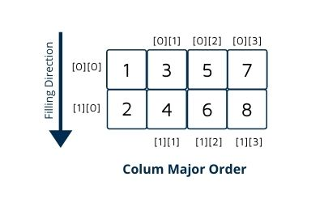

# Column-major Order

<figure><figcaption></figcaption></figure>

#### 存取方式

原矩陣：

| a | b | c | d |
| - | - | - | - |
| e | f | g | h |
| i | j | k | l |

以column方式存取：

<table data-header-hidden data-full-width="false"><thead><tr><th></th><th></th><th></th><th></th><th></th><th></th><th></th><th></th><th></th><th></th><th></th><th></th></tr></thead><tbody><tr><td>a</td><td>e</td><td>i</td><td>b</td><td>f</td><td>j</td><td>c</td><td>g</td><td>k</td><td>d</td><td>h</td><td>l</td></tr></tbody></table>

#### 計算記憶體位址

|        |                                  |                                    |
| ------ | -------------------------------- | ---------------------------------- |
| A      | address                          | a\[0],a\[0]\[0],a\[0]\[0]\[0],etc. |
| B      | memory size                      | char = 1 bytes; int = 4 bytes;     |
| 2D->1D | A + (i + j\*u1) \* B             | a\[u1]\[u2]                        |
| 3D->1D | A + (i + j\*u1 + k\*u1\*u2) \* B | a\[u1]\[u2]\[u3]                   |

