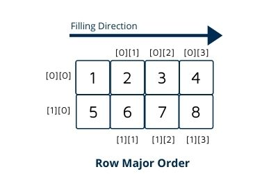

# Row-major Order(From 2D to 1D)

<figure><figcaption></figcaption></figure>

#### 存取方式：

<table data-full-width="false"><thead><tr><th align="center">physical structure</th></tr></thead><tbody><tr><td align="center">a[0][0]</td></tr><tr><td align="center">a[0][1]</td></tr><tr><td align="center">a[0][2]</td></tr><tr><td align="center">a[0][3]</td></tr><tr><td align="center">a[1][0]</td></tr><tr><td align="center">a[1][1]</td></tr><tr><td align="center">a[1][2]</td></tr><tr><td align="center">a[1][3]</td></tr></tbody></table>

#### 計算陣列中某元素所在的記憶體位址：

<table><thead><tr><th width="122.33333333333331">計算數</th><th width="325">說明</th><th>舉例</th></tr></thead><tbody><tr><td>A</td><td>陣列初始位址</td><td>a[0], a[0][0], a[0][0][0],etc.</td></tr><tr><td>B</td><td>每個元素的記憶體大小</td><td>char = 1 bytes; int = 4 bytes;</td></tr><tr><td>2D->1D</td><td>a[i][j] = A + (i*u2 + j) * B</td><td>a[u1][u2]</td></tr><tr><td>3D->1D</td><td>a[i][j][k] = A + (i*u2*u3 + j*u3 + k) * B</td><td>a[u1][u2][u3]</td></tr></tbody></table>

