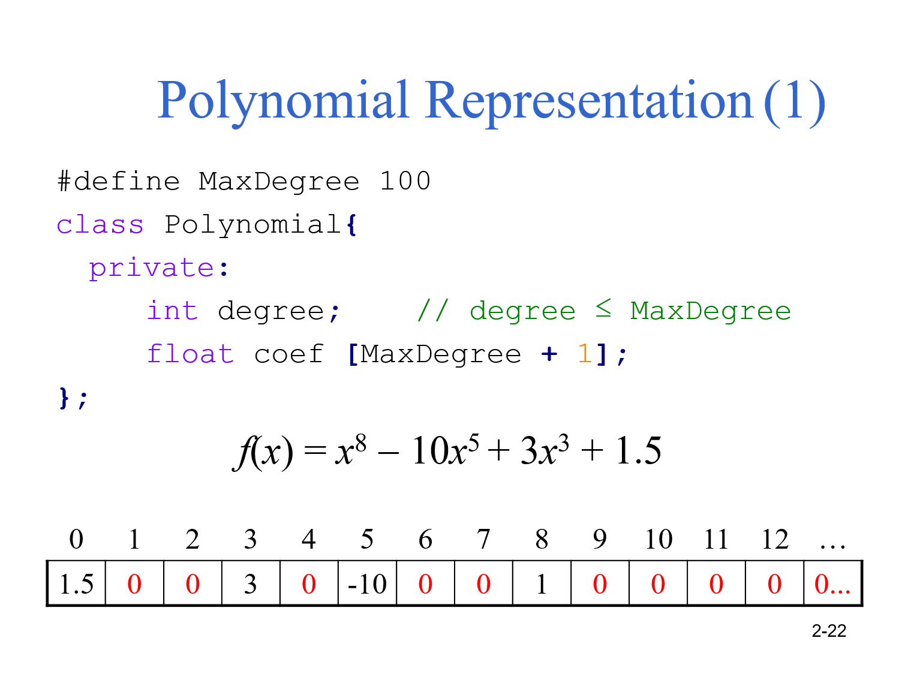
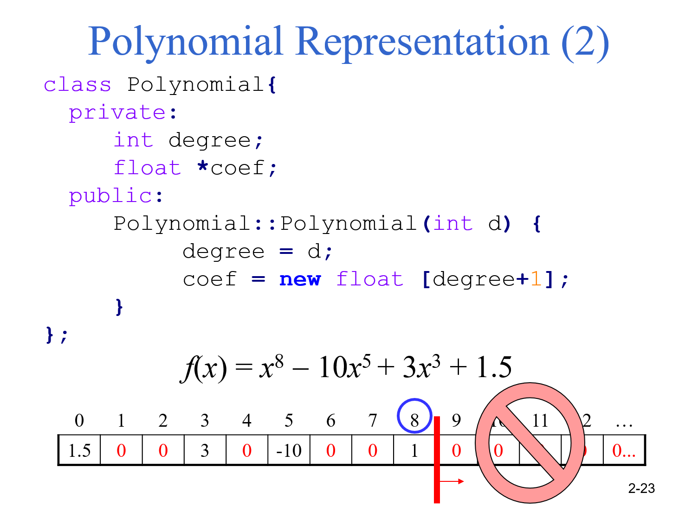
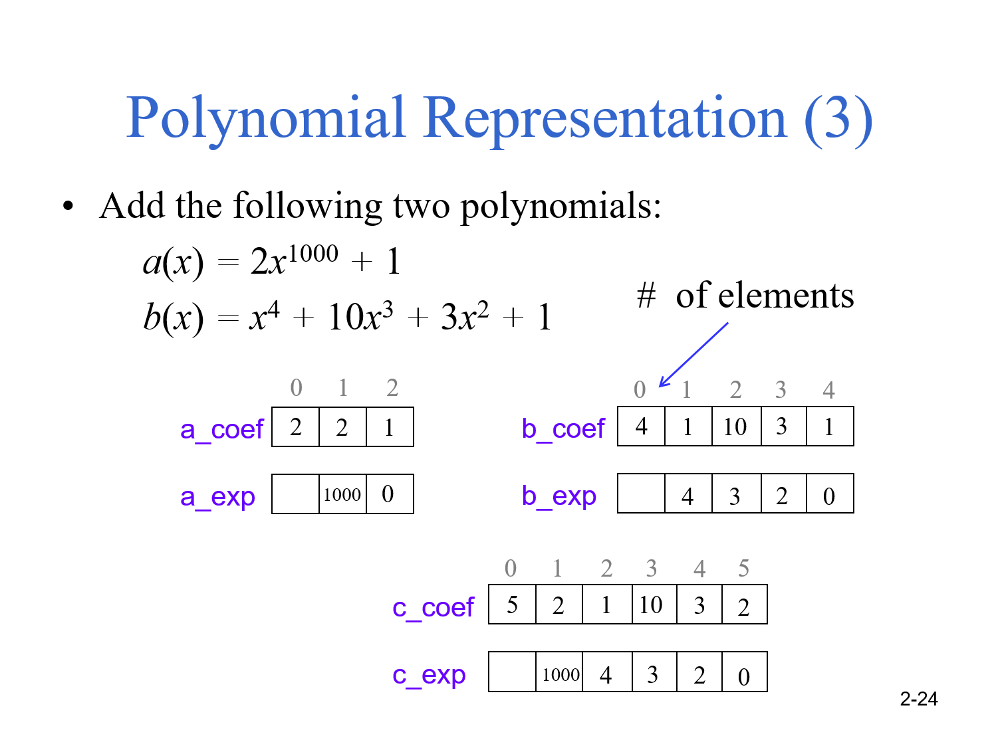

# Polynomial

#### 我們可以宣告一個一維陣列來存放多項式中每一個次方的係數

<figure><figcaption></figcaption></figure>

#### 也可以使用動態宣告陣列，在需要時才跟系統要空間

<figure><figcaption></figcaption></figure>

#### 如果多項式屬於只有頭尾有值，則可以改用兩個陣列儲存，一個存係數、一個存次方&#x20;

<figure><figcaption></figcaption></figure>
